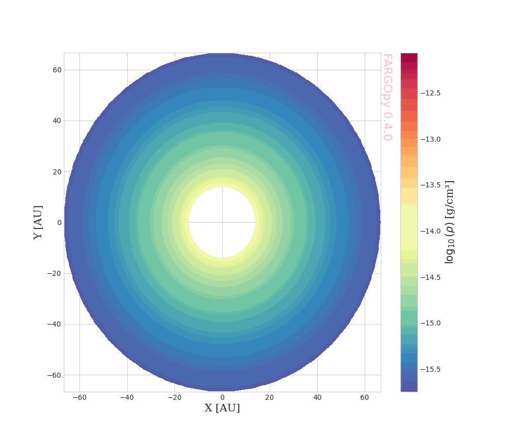
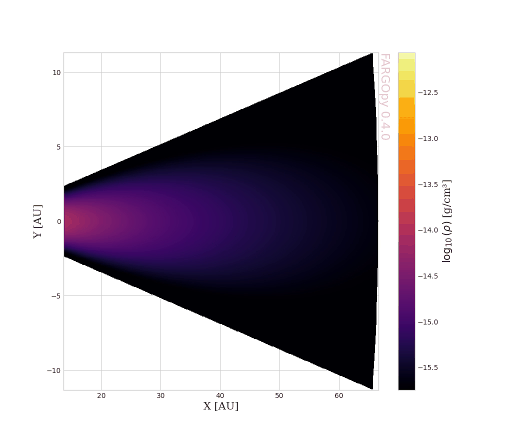

<p></p>
<div align="center">
  
</div>
<p></p>

<h2 align="center">FARGO3D wrapping and beyond</h2>

<!-- This are visual tags that you may add to your package at the beginning with useful information on your package -->
[](https://pypi.org/project/fargopy/) 
[](https://pypi.org/project/fargopy/) 
[](https://github.com/seap-udea/fargopy/blob/master/LICENSE) 
[](https://pypi.org/project/fargopy/) 
[](https://fargo3d.bitbucket.io/)
<!--[](https://arxiv.org/abs/0000.00000)-->
<a target="_blank" href="https://colab.research.google.com/github/seap-udea/fargopy/blob/main/README.ipynb">
  
</a>

## Resources

- **GitHub Repository**: [https://github.com/seap-udea/fargopy](https://github.com/seap-udea/fargopy)
- **Documentation**: [https://fargopy.readthedocs.io](https://fargopy.readthedocs.io)
- **PyPI Page**: [https://pypi.org/project/fargopy/](https://pypi.org/project/fargopy/)

These are animations created with a few lines of code using `FARGOpy`.

<div align="center">
  
  
</div>

For the code used to generate animations see the tutorial notebook [animations with `FARGOpy`](https://github.com/seap-udea/fargopy/blob/main/examples/fargopy-tutorial-animations.ipynb). For other examples and a full tutorial see the [examples repository](https://github.com/seap-udea/fargopy/blob/main/examples).

## Installing `FARGOpy`

`FARGOpy` is available at the `Python` package index and can be installed using:

```bash
$ sudo pip install fargopy
```
as usual this command will install all dependencies (excluding `FARGO3D` which must be installed indepently as explained before) and download some useful data, scripts and constants.


> **NOTE**: If you don't have access to `sudo`, you can install `FARGOpy` in your local environmen (usually at `~/.local/`). In that case you need to add to your `PATH` environmental variable the location of the local python installation. Add to `~/.bashrc` the line `export PATH=$HOME/.local/bin:$PATH`

Since `FARGOpy` is a python wrap for `FARGO3D` the ideal environment to work with the package is `IPython`/`Jupyter`. It works really fine in `Google Colab` ensuing training and demonstration purposes. This README, for instance, can be ran in `Google Colab`:

<a target="_blank" href="https://colab.research.google.com/github/seap-udea/fargopy/blob/main/README.ipynb">
  
</a>

This code only works in Colab and it is intended to install the latest version of `FARGOpy`


```python
import sys
if 'google.colab' in sys.modules:
    !sudo pip install -Uq fargopy
```

       ━━━━━━━━━━━━━━━━━━━━━━━━━━━━━━━━━━━━━━━━ 47.6/47.6 kB 4.3 MB/s eta 0:00:00
       ━━━━━━━━━━━━━━━━━━━━━━━━━━━━━━━━━━━━━━━━ 1.6/1.6 MB 29.3 MB/s eta 0:00:00
    [?25h

If you are working in `Jupyter` or in `Google Colab`, the configuration directory and its content will be crated the first time you import the package:


```python
import fargopy as fp

# These lines are intented for developing purposes; drop them in your code
%load_ext autoreload
%autoreload 2
```

    Configuring FARGOpy for the first time
    Running FARGOpy version 0.4.0


If you are working on a remote Linux server, it is better to run the package using `IPython`. For this purpose, after installation, `FARGOpy` provides a special initialization command:

```bash
$ ifargopy
```

The first time you run this script, it will create a configuration directory `~/.fargopy` (with `~` the abbreviation for the home directory). This directory contains a set of basic configuration variables which are stored in the file `~/.fargopy/fargopyrc`. You may change this file if you want to customize the installation. The configuration directory also contains the `IPython` initialization script `~/.fargopy/ifargopy.py`.

## Quickstart

First, import the package:


```python
import fargopy as fp
import matplotlib.pyplot as plt
```

Download a precomputed simulation to test the package:


```python
# Download precomputed simulation
fp.Simulation.download_precomputed('fargo')
```

Connect to the simulation output directory:


```python
# Connect to simulation
sim = fp.Simulation(output_dir='/tmp/fargo')
```

Load a field (e.g., gas density) from a specific snapshot:


```python
# Load density field from snapshot 20
gasdens = sim.load_field('gasdens', snapshot=20)
```

Create a 2D slice of the field and plot it:


```python
# Create meshslice and plot
gasdens_plane, mesh = gasdens.meshslice(slice='z=0')

fig, ax = plt.subplots(figsize=(10,8))
ax.pcolormesh(mesh.x, mesh.y, gasdens_plane, cmap='turbo')
ax.axis('equal')
ax.set_xlabel('x [au]')
ax.set_ylabel('y [au]')
fp.Plot.fargopy_mark(ax)
plt.show()
```

## Tutorials

Check out the following tutorials to learn more about `FARGOpy`:

- [Basics](https://github.com/seap-udea/fargopy/blob/main/examples/fargopy-tutorial-basics.ipynb)
- [Control Mode](https://github.com/seap-udea/fargopy/blob/main/examples/fargopy-tutorial-control.ipynb)
- [Flux Calculation](https://github.com/seap-udea/fargopy/blob/main/examples/fargopy-tutorial-flux.ipynb)
- [Field Interpolation](https://github.com/seap-udea/fargopy/blob/main/examples/fargopy-tutorial-interpolation.ipynb)
- [Vector Fields](https://github.com/seap-udea/fargopy/blob/main/examples/fargopy-tutorial-vector_fields.ipynb)

## Advanced: Control Mode (FARGO3D)

While `FARGOpy` is primarily a post-processing tool, it also offers a "Control Mode" to compile and run `FARGO3D` simulations directly from Python.

You do **not** need to install `FARGO3D` to use the post-processing features. However, if you wish to use the Control Mode, you can download the source code using the following command:


```python
fp.initialize('download', force=True)
```

This will download `FARGO3D` to your home directory (`~/fargo3d/`). You can then compile it using `fp.initialize('check', ...)` as shown in the [Control Mode tutorial](https://github.com/seap-udea/fargopy/blob/main/examples/fargopy-tutorial-control.ipynb), provided you have the necessary system dependencies (C/CUDA compilers, MPI).

## What's New

For a detailed list of changes and new features in each version, please see the [WHATSNEW.md](https://github.com/seap-udea/fargopy/blob/main/WHATSNEW.md) file.

## License

This project is licensed under the AGPLv3 License - see the [LICENSE](https://github.com/seap-udea/fargopy/blob/master/LICENSE) file for details.

---
*Powered by fargopy*. For more examples see [fargopy GitHub repo](https://github.com/seap-udea/fargopy/tree/main/examples). 

Jorge I. Zuluaga, Alejandro Murillo-González and Matías Montesinos © 2023-present

