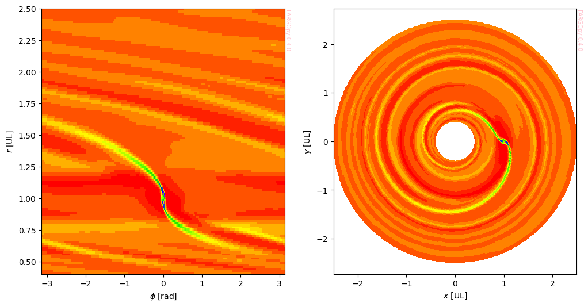

# FARGOpy
## Wrapping FRAGO3D

<!-- This are visual tags that you may add to your package at the beginning with useful information on your package -->
[](https://pypi.org/project/fargopy/)
[](https://pypi.org/project/fargopy/)
<a target="_blank" href="https://colab.research.google.com/github/seap-udea/fargopy/blob/main/README.ipynb">
  
</a>

`FARGOpy` is a python wrapping for [`FARGO3D`](https://fargo3d.bitbucket.io/intro.html), the well-knwon hydrodynamics and magnetohydrodynamics parallel code. This wrapping is intended to facillitate the interaction with FARGO3D, especially for those starting using the code. `FARGOpy` may be also useful for teaching and training purposes. For advanced users, `FARGOpy` provides useful functionalities in the postprocessing of simulation results, derivative calculations and plots.

This is an animation created with a few lines of code using `FARGOpy`.
<p align="center"></p>

For the code used to generate this animation see the tutorial notebook [animations with `FARGOpy`](https://github.com/seap-udea/fargopy/blob/main/examples/fargopy-tutorial-animations.ipynb). For other examples and a full tutorial see the [examples repository](https://github.com/seap-udea/fargopy/blob/main/examples).

## Installing `FARGOpy`

`FARGOpy` is available at the `Python` package index and can be installed using:

```bash
$ sudo pip install fargopy
```
as usual this command will install all dependencies (excluding `FARGO3D` which must be installed indepently as explained before) and download some useful data, scripts and constants.


> **NOTE**: If you don't have access to `sudo`, you can install `FARGOpy` in your local environmen (usually at `~/.local/`). In that case you need to add to your `PATH` environmental variable the location of the local python installation. Add to `~/.bashrc` the line `export PATH=$HOME/.local/bin:$PATH`

Since `FARGOpy` is a python wrap for `FARGO3D` the ideal environment to work with the package is `IPython`/`Jupyter`. It works really fine in `Google Colab` ensuing training and demonstration purposes. This README, for instance, can be ran in `Google Colab`:

<a target="_blank" href="https://colab.research.google.com/github/seap-udea/fargopy/blob/main/README.ipynb">
  
</a>

This code only works in Colab and it is intended to install the latest version of `FARGOpy`


```python
import sys
if 'google.colab' in sys.modules:
    !sudo pip install -Uq fargopy
```

       ━━━━━━━━━━━━━━━━━━━━━━━━━━━━━━━━━━━━━━━━ 47.6/47.6 kB 4.3 MB/s eta 0:00:00
       ━━━━━━━━━━━━━━━━━━━━━━━━━━━━━━━━━━━━━━━━ 1.6/1.6 MB 29.3 MB/s eta 0:00:00
    [?25h

If you are working in `Jupyter` or in `Google Colab`, the configuration directory and its content will be crated the first time you import the package:


```python
import fargopy as fp

# These lines are intented for developing purposes; drop them in your code
%load_ext autoreload
%autoreload 2
```

    Configuring FARGOpy for the first time
    Running FARGOpy version 0.4.0


If you are working on a remote Linux server, it is better to run the package using `IPython`. For this purpose, after installation, `FARGOpy` provides a special initialization command:

```bash
$ ifargopy
```

The first time you run this script, it will create a configuration directory `~/.fargopy` (with `~` the abbreviation for the home directory). This directory contains a set of basic configuration variables which are stored in the file `~/.fargopy/fargopyrc`. You may change this file if you want to customize the installation. The configuration directory also contains the `IPython` initialization script `~/.fargopy/ifargopy.py`.

## Downloading and installing FARGO3D

It is important to understand that `FARGO3D` works especially well on Linux plaforms (including `MacOS`). The same condition applies for `FARGOpy`. Because of that, most of the internal as well as the public features of the packages are designed to work in a `Linux` environment. For working in other operating systems, especially on MS Windows, please consider using virtual machines ow WSL.

Being an independent project, `FARGOpy` is not provided with a working version of `FARGO3D`. You need to download the C package and their prerequisites (compilers, third-party libraries, etc.) and configure them, by yourself. For a detailed guide please see the [FARGO3D documentation](https://fargo3d.bitbucket.io/index.html) or the [project repo at bitbucket](https://bitbucket.org/fargo3d/public/src/ae0fcdc67bb7c83aed85fc9a4d4a2d5061324597/?at=release%2Fpublic).

Still `FARGOpy` provides a simple way to get the latest version of the source code of `FARGO3D` from its public GitHub repository. The source code will be downloaded into the home directory and stored as `~/fargo3d/`.

> **WARNING**: If you want to change the final location of the source code or the name of the `FARGO3D` directory,  before executing the following command, please change the corresponding configuration variables in `~/.fargopy/fargopyrc`

To download the `FARGO3D` source code execute:


```python
fp.initialize('download',force=True)
```

    Downloading FARGOpy...
    	FARGO3D downloaded to /root/fargo3d/
    Header file for FARGO3D found in the fargo directory /root/fargo3d/


Once download it you may check if the source code is compiling in your machine. For that purpose run:


```python
fp.initialize?
```


```python
fp.initialize('check',regular=1,gpu=1,parallel=0)
```

    Test compilation of FARGO3D
    	Checking normal compilation.
    	Running 'make -C /root/fargo3d/ clean mrproper all PARALLEL=0 GPU=0 2>&1 |tee /tmp/fargo_regular.log':
    		Compilation in mode regular successful.
    	Checking normal compilation.
    	Running 'make -C /root/fargo3d/ clean mrproper all PARALLEL=0 GPU=1 2>&1 |tee /tmp/fargo_gpu.log':
    		Compilation in mode gpu successful.
    	Skipping parallel compilation
    Summary of compilation modes:
    	Regular: 1
    	GPU: 1
    	Parallel: 0


If you have some error at compiling `FARGO3D` in some of the possible modes (regular, gpu and/or parallel) please check the corresponding logfile and correct the problems. Compiling problems will normally arise because of a lacking of an important dependency, for instance a compiler, a driver (in the case of GPU) or a third-party library or tool (eg. openmpi).

## Quickstart

Here we will illustrate the minimal commands you may run to test the package. A more detailed set of examples can be found exploring [the tutorial notebooks](https://github.com/seap-udea/fargopy/blob/main/examples). Other in depth examples are also available in the [examples repository](https://github.com/seap-udea/fargopy/tree/main/examples) of the `GitHub` repository.

There are two complimentary modes when using `FARGOpy`:

- **Control mode**: Using this mode you can run and control `FARGO3D` from your notebook.  This mode requires a working copy of `FARGO3D` ready to be compiled and run. This mode is ideal for training or testing purposes.

- **Postprocessing mode**: Using `FARGOpy` in this mode allows you to process some of the output files produced by a `FARGO3D` simulation. This mode does not necesarily requires that a working copy of `FARGO3D` be installed in the machine where you are performing the postprocessing analysis. This mode is ideal for advanced users.

### Control mode

Create a simulation:


```python
sim = fp.Simulation(setup='fargo')
```

    Your simulation is now connected with '/root/fargo3d/'
    Now your simulation setup is at '/root/fargo3d/setups/fargo'


Compile the `FARGO3D` binary to run the simulation:


```python
sim.compile(parallel=0,gpu=0)
```

    Compiling fargo3d-SETUP_fargo-PARALLEL_0-GPU_0...
    Succesful compilation of FARGO3D binary fargo3d-SETUP_fargo-PARALLEL_0-GPU_0


Run the simulation:


```python
sim.run(cleanrun=True)
```

    Cleaning output directory /root/fargo3d/outputs/fargo
    Running asynchronously (test = False):  ./fargo3d-SETUP_fargo-PARALLEL_0-GPU_0 -m -t setups/fargo/fargo.par
    Now you are connected with output directory '/root/fargo3d/outputs/fargo'
    Found a variables.par file in '/root/fargo3d/outputs/fargo', loading properties
    Loading variables
    84 variables loaded
    Simulation in 2 dimensions
    Loading domain in cylindrical coordinates:
    	Variable phi: 384 [[0, np.float64(-3.1334114227210694)], [-1, np.float64(3.1334114227210694)]]
    	Variable r: 128 [[0, np.float64(0.408203125)], [-1, np.float64(2.491796875)]]
    	Variable z: 1 [[0, np.float64(0.0)], [-1, np.float64(0.0)]]
    Number of snapshots in output directory: 1
    Planets found in summary.dat:
      Name: Jupiter, Distance: 1.0, Mass: 0.001
    Configuration variables and domains load into the object. See e.g. <sim>.vars


You may check the status:


```python
sim.status()
```

    
    ################################################################################
    Running status of the process:
    	The process is running.
    
    Other status modes: 'isrunning', 'logfile', 'outputs', 'progress', 'summary'


Or check the progress of the simulation:


```python
sim.status('progress')
```

    
    ################################################################################
    
    Progress of the simulation (interrupt by pressing 'enter' or the stop button):
    1:OUTPUTS 6 at date t = 37.699112 OK [output pace = 0.1 secs] <Press 'enter' to interrupt>
    2:OUTPUTS 7 at date t = 43.982297 OK [output pace = 0.1 secs] <Press 'enter' to interrupt>
    3:OUTPUTS 8 at date t = 50.265482 OK [output pace = 1.0 secs] <Press 'enter' to interrupt>
    4:OUTPUTS 9 at date t = 56.548668 OK [output pace = 3.7 secs] <Press 'enter' to interrupt>
    Interrupted by user. In some environment (IPython, Colab) stopping the progress status will stop the simulation. In that case just resume.
    
    Other status modes: 'isrunning', 'logfile', 'outputs', 'progress', 'summary'


You may stop the simulation at any time using:


```python
sim.stop()
```

    The process is locked by PID 12265
    The process has finished. Check logfile /root/fargo3d/setups/fargo/fargo.log.


Check the status of the simulation using:


```python
sim.status('summary')
```

    
    ################################################################################
    Summary:
    The simulation has been ran for 10 time-steps (including the initial one).
    
    Other status modes: 'isrunning', 'logfile', 'outputs', 'progress', 'summary'


Once stopped you may resume the simulation at any snapshot or at the latest resumable snapshot:


```python
sim.resume()
```

    Resuming from snapshot 8...
    Running asynchronously (test = False):  ./fargo3d-SETUP_fargo-PARALLEL_0-GPU_0 -m -t -S 8 -t setups/fargo/fargo.par
    Now you are connected with output directory '/root/fargo3d/outputs/fargo'
    Found a variables.par file in '/root/fargo3d/outputs/fargo', loading properties
    Loading variables
    84 variables loaded
    Simulation in 2 dimensions
    Loading domain in cylindrical coordinates:
    	Variable phi: 384 [[0, np.float64(-3.1334114227210694)], [-1, np.float64(3.1334114227210694)]]
    	Variable r: 128 [[0, np.float64(0.408203125)], [-1, np.float64(2.491796875)]]
    	Variable z: 1 [[0, np.float64(0.0)], [-1, np.float64(0.0)]]
    Number of snapshots in output directory: 10
    Planets found in summary.dat:
      Name: Jupiter, Distance: 1.0, Mass: 0.001
    Configuration variables and domains load into the object. See e.g. <sim>.vars


```python
sim.status('progress')
```

    
    ################################################################################
    
    Progress of the simulation (interrupt by pressing 'enter' or the stop button):
    1:OUTPUTS 11 at date t = 69.115038 OK [output pace = 0.1 secs] <Press 'enter' to interrupt>
    2:OUTPUTS 12 at date t = 75.398224 OK [output pace = 0.1 secs] <Press 'enter' to interrupt>
    Interrupted by user. In some environment (IPython, Colab) stopping the progress status will stop the simulation. In that case just resume.
    
    Other status modes: 'isrunning', 'logfile', 'outputs', 'progress', 'summary'


Once the simulation has been completed you will notice by ran:


```python
sim.stop()
```

    The process is locked by PID 12917
    The process has finished. Check logfile /root/fargo3d/setups/fargo/fargo.log.


### Postprocessing mode

Now that you have some results to process, it is time to use the functionalities that `FARGOpy` provides for this purpose.

Create the simulation and connect it to the output directory:


```python
sim = fp.Simulation(output_dir = fp.Conf.FP_FARGO3D_DIR + '/outputs/fargo')
```

    Your simulation is now connected with '/root/fargo3d/'
    Now you are connected with output directory '/root/fargo3d//outputs/fargo'
    Found a variables.par file in '/root/fargo3d//outputs/fargo', loading properties
    Loading variables
    84 variables loaded
    Simulation in 2 dimensions
    Loading domain in cylindrical coordinates:
    	Variable phi: 384 [[0, np.float64(-3.1334114227210694)], [-1, np.float64(3.1334114227210694)]]
    	Variable r: 128 [[0, np.float64(0.408203125)], [-1, np.float64(2.491796875)]]
    	Variable z: 1 [[0, np.float64(0.0)], [-1, np.float64(0.0)]]
    Number of snapshots in output directory: 14
    Planets found in summary.dat:
      Name: Jupiter, Distance: 1.0, Mass: 0.001
    Configuration variables and domains load into the object. See e.g. <sim>.vars


```python
sim.load_properties()
```

    Loading variables
    84 variables loaded
    Simulation in 2 dimensions
    Loading domain in cylindrical coordinates:
    	Variable phi: 384 [[0, np.float64(-3.1334114227210694)], [-1, np.float64(3.1334114227210694)]]
    	Variable r: 128 [[0, np.float64(0.408203125)], [-1, np.float64(2.491796875)]]
    	Variable z: 1 [[0, np.float64(0.0)], [-1, np.float64(0.0)]]
    Number of snapshots in output directory: 14
    Planets found in summary.dat:
      Name: Jupiter, Distance: 1.0, Mass: 0.001
    Configuration variables and domains load into the object. See e.g. <sim>.vars


Load gas density field from a given snapshot:


```python
gasdens = sim.load_field('gasdens',snapshot=5)
```

Create a `meshslice` of the field:


```python
gasdens_r, mesh = gasdens.meshslice(slice='z=0,phi=0')
```

Plot the slice:


```python
import matplotlib.pyplot as plt
if not fp.IN_COLAB:plt.ioff() # Drop this out of this tutorial
fig,ax = plt.subplots()

ax.semilogy(mesh.r,gasdens_r)

ax.set_xlabel(r"$r$ [cu]")
ax.set_ylabel(r"$\rho$ [cu]")
fp.Plot.fargopy_mark(ax)
if not fp.IN_COLAB:fig.savefig('gallery/example-dens_r.png') # Drop this out of this tutorial
```

<p align="center"></p>

You may also create a 2-dimensional `meshslice`:


```python
gasdens_plane, mesh = gasdens.meshslice(slice='z=0')
```

And plot it:


```python
if not fp.IN_COLAB:plt.ioff() # Drop this out of this tutorial
fig,axs = plt.subplots(1,2,figsize=(12,6))

ax = axs[0]

ax.pcolormesh(mesh.phi,mesh.r,gasdens_plane,cmap='prism')

ax.set_xlabel('$\phi$ [rad]')
ax.set_ylabel('$r$ [UL]')
fp.Plot.fargopy_mark(ax)

ax = axs[1]

ax.pcolormesh(mesh.x,mesh.y,gasdens_plane,cmap='prism')

ax.set_xlabel('$x$ [UL]')
ax.set_ylabel('$y$ [UL]')
fp.Plot.fargopy_mark(ax)
ax.axis('equal')
if not fp.IN_COLAB:fig.savefig('gallery/example-dens_disk.png') # Drop this out of this tutorial
```


    

    


<p align="center"></p>

### Working with precomputed simulations

If you don't have the resources to compile or run `FARGO3D` and still you want to test the postprocessing functionalities of the package you may download a precomputed simulation:


```python
fp.Simulation.download_precomputed(setup='fargo')
```

    Downloading fargo.tgz from cloud (compressed size around 55 MB) into /tmp


    Downloading...
    From: https://docs.google.com/uc?export=download&id=1YXLKlf9fCGHgLej2fSOHgStD05uFB2C3
    To: /tmp/fargo.tgz
    100%|██████████| 54.7M/54.7M [00:02<00:00, 19.1MB/s]


    Uncompressing fargo.tgz into /tmp/fargo
    Done.


Once downloaded you may connect with simulation using:


```python
sim = fp.Simulation(output_dir = '/tmp/fargo')
```

    Your simulation is now connected with '/home/jzuluaga/fargo3d/'
    Now you are connected with output directory '/tmp/fargo'


and perform the postprocessing as explained before.

We have prepared a set of precomputed simulations covering some interesting scientific cases. You may see the list of precomputed simulations available in the `FARGOpy` [cloud repository](https://drive.google.com/drive/folders/1NRdNOcmxRK-pHv_8vR-aAAJGWXxIOY0J?usp=sharing):


```python
fp.Simulation.list_precomputed()
```

    fargo:
    	Description: Protoplanetary disk with a Jovian planet [2D]
    	Size: 55 MB
    p3diso:
    	Description: Protoplanetary disk with a Super earth planet [3D]
    	Size: 220 MB
    p3disoj:
    	Description: Protoplanetary disk with a Jovian planet [3D]
    	Size: 84 MB
    fargo_multifluid:
    	Description: Protoplanetary disk with several fluids (dust) and a Jovian planet in 2D
    	Size: 100 MB
    binary:
    	Description: Disk around a binary with the properties of Kepler-38 in 2D
    	Size: 140 MB


You may find in the [examples directory](https://github.com/seap-udea/fargopy/tree/main/examples) of the `GitHub` repository, example notebooks illustrating how to use `FARGOpy` for processing the output of this precomputed simulations.

## What's new

Version 0.4.*:
- Field interpolation in 1D, 2D, and 3D with evaluation at arbitrary points and times.
- Analytical surface definition and tessellation for integration.
- Calculation of mass flux and total mass through/inside surfaces.
- Flexible field slicing and mesh generation for visualization and analysis.

Version 0.3.*:

- Refactoring of initializing routines.
- Improvements in documentation of basic classes in `__init__.py`.
- Precomputed simulations uploaded to FARGOpy Cloud Repository and available usnig `download_precomputed` static method.

Version 0.2.*:

- First real applications tested with FARGOpy.
- All basic routines for reading output created.
- Major refactoring. 

Version 0.1.*:

- Package is now provided with a script 'ifargopy' to run 'ipython' with fargopy initialized.
- A new 'progress' mode has been added to status method.
- All the dynamics of loading/compiling/running/stoppìng/resuming FARGO3D has been developed.

Version 0.0.*:

- First classes created.
- The project is started!


------------

This package has been designed and written mostly by Jorge I. Zuluaga and Alejandro Murillo-González with advising and contributions by Matías Montesinos (C) 2023, 2024, 2025

